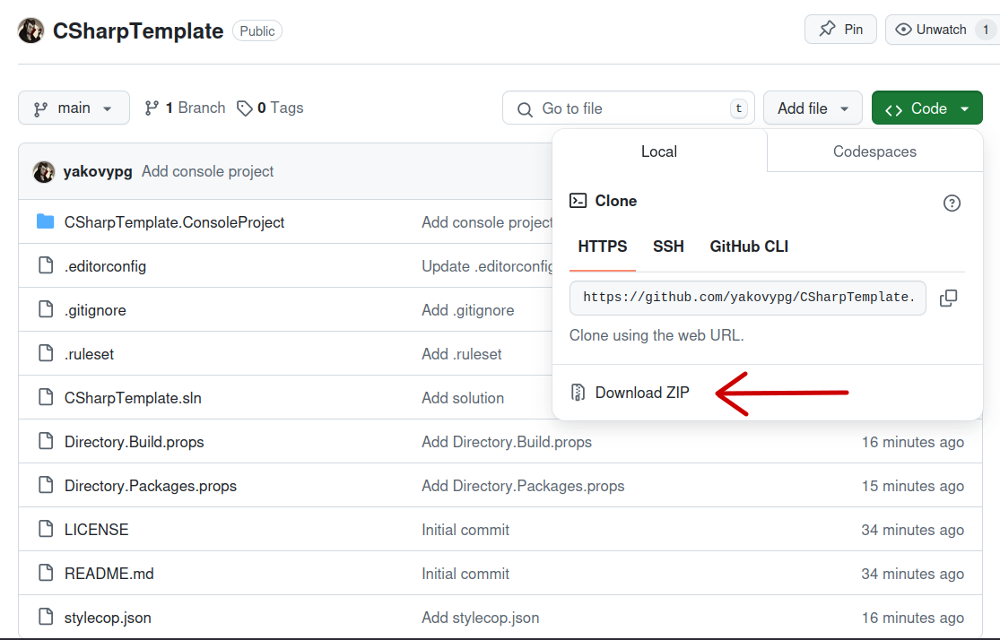

<h1 align="center">CSharpTemplate</h1>
<p align="center">
  
</p>

<p align="center">
  <a href="https://github.com/yakovypg/CSharpTemplate/blob/main/LICENSE">
    
  </a>
  
  
</p>

## About
**CSharpTemplate** is a template solution for C# practices.

## Quick Start
At first, clone the repository or download and unzip `.zip` file. Then open created folder in your IDE (if you are using Visual Studio, open `CSharpTemplate.sln` file in this folder). Finally, find `CSharpTemplate.ConsoleProject` project and start coding.

```
git clone https://github.com/yakovypg/CSharpTemplate.git
```



## Recommendations
Follow these recommendations:
1. Follow [SOLID](https://metanit.com/sharp/patterns/5.1.php) and [GRASP](https://bool.dev/blog/detail/grasp-printsipy) principles.
2. Read these articles about coding style:
    - [Common C# code conventions](https://learn.microsoft.com/ru-ru/dotnet/csharp/fundamentals/coding-style/coding-conventions)
    - [Capitalization Conventions](https://learn.microsoft.com/ru-ru/dotnet/standard/design-guidelines/capitalization-conventions)
    - [Common C# coding style](https://github.com/itmo-is-dev/.github/blob/master/codestyle.md#general)
3. Don't edit configuration files and follow all coding rules.
